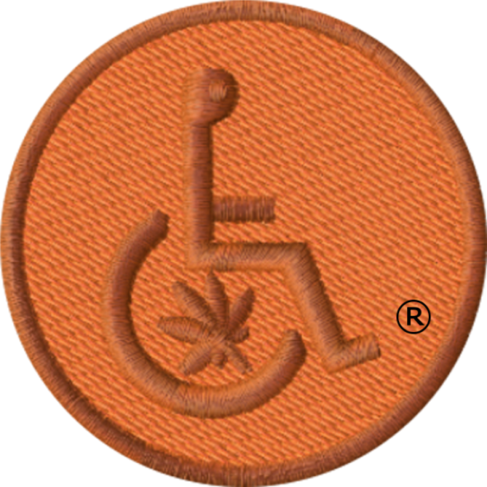

## Two Coins

One of the coins expected to hit the market in 2025 via Initial Coin Offering or ICO is our Medcoin™ Tangerine Copper coin patterned against our federally registered Medical Marijuana Initiative USPTO Trade Mark Logo Badge.

### Tangerine Copper

{:width="120px"}

### Gold Badge

The other coin expected to hit the market in the year 2025 is our Medcoin™ Gold coin also patterned against our federally registered Medical Marijuana Initiative USPTO Trade Mark Logo Badge, as well.

As follows,

{:width="120px"}
