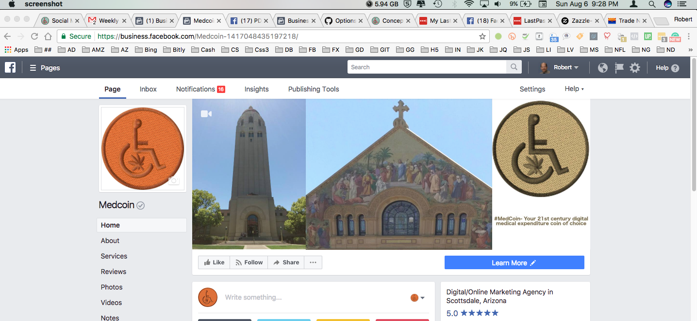
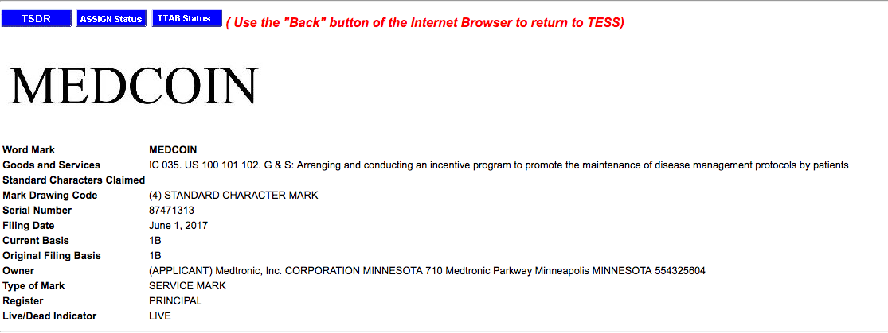
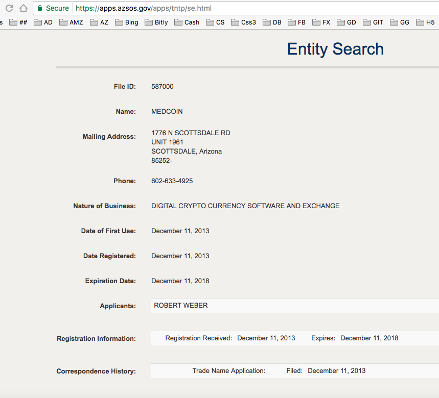
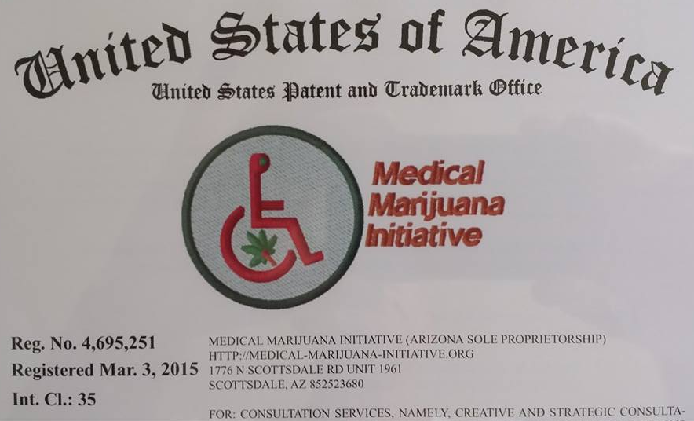
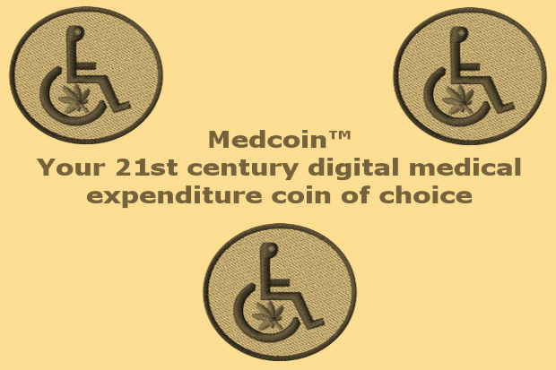



## First Subtitle

> **Hint**. {{ page.hint }}

More to come ...



## Company Logo Badge

The design has been colorized to convey a traditional coin of commemorative value.

## Medcoin™ Verified Facebook Page

The company operates a verified Facebook page under the Medcoin™ name.

- [Medcoin™ Verified Facebook Page: FULL URL](https://business.facebook.com/Medcoin-1417048435197218/){:title="Click to Visit the ..."}{:target="_blank"}.

```liquid

[Medcoin™ Verified Facebook Page: FULL URL](https://business.facebook.com/Medcoin-1417048435197218/){:title="Click to Visit the ..."}{:target="_blank"}.

```

- [Medcoin™ Verified Facebook Page: Tiny URL](https://medmj.us/Medcoin-FB){:title="Click to Visit the ..."}{:target="_blank"}.

```liquid

[Medcoin™ Verified Facebook Page: Tiny URL](https://medmj.us/Medcoin-FB){:title="Click to Visit the ..."}{:target="_blank"}.

```

- [Medcoin™ Verified Facebook Page: Short URL](https://www.fb.me/Medcoin){:title="Click to Visit the ..."}{:target="_blank"}.

```liquid

[Medcoin™ Verified Facebook Page: Short URL](https://www.fb.me/Medcoin){:title="Click to Visit the ..."}{:target="_blank"}.

```

- [Medcoin™ Verified Facebook Page: Message Me](https://m.me/Medcoin){:title="Click to Visit the ..."}{:target="_blank"}.

```liquid

[Medcoin™ Verified Facebook Page: Message Me](https://m.me/Medcoin){:title="Click to Visit the ..."}{:target="_blank"}.

```

### Medcoin™ Verified Facebook Page: Current Screen Snap



## Timeline

Original FB Message From ... [PD Medcoin™](https://www.facebook.com/pd.Medcoin){:title="Click to Visit the ..."}{:target="_blank"}.

## July 5th, #2017

Hello PD! Thx for your contact! I am out of the office at this moment and away from my desk. As soon as I get a moment I will text you back. But, not when driving! Take care, A-dios! Robert Hempaz, PhD Trichometry™

- via FB

## August 6th, #2017

Hi! Thx for the hit ... I checked the US TESS system for a match and I see that Medtronic Corp out of Minnesota "world" trademarked the name **Medcoin™** this June of #2017 ( see attached (.png). However, as you can see by the second attached (.png) my trade name at the Az SOS supersedes by about (4) years. As the underlying "copper" colored logo badge is trademarked by the USPTO separately under Class 35 ( Marketing ) and the Benefit Corp has made a decision to operate under this name, established for (4) years here in the State of Arizona, how again do you feel I am at fault to the point I must remove this Facebook page?

## Supporting Images: Medcoin™

More to come ...

### via Tess



### via Az SOS



### via USPTO

- Image



- Live Link

[Medcoin™ Logo Badge Registration Certificate via Pinterest](https://medmj.us/RegistrationCertificate){:title="Click to Visit the ..."}{:target="_blank"}.

### via Indie GoGo

- Image



- Live Link

[Medcoin™ Indie GoGo Capital Campaign](https://medmj.us/RegistrationCertificate){:title="Click to Visit the ..."}{:target="_blank"}.

## Medcoin™ Twitter Account

The company also operates a Twitter account under the name of Medcoin™ and handle **@medcoin**, as well.

Tweet #1 [@Medcoin™](https://www.twitter.com/Medcoin){:title="Click to Visit the Twitter home page of @medcoin"}{:target="_blank"}

- Medcoin™ Twitter Account Tweet Dtd: Live Link

> [@RepDavid](https://www.twitter.com/RepDavid){:title="Click to Visit the ..."}{:target="_blank"}: Will you allow #MedMj transactions to be archived via #BC aka 'Blockchain'?
> [C=> http://www.itworld.com/video/74455/how-blockchain-can-help-drive-cybersecurity](http://www.itworld.com/video/74455/how-blockchain-can-help-drive-cybersecurity){:target="_blank"}

- Medcoin™ Twitter Account Tweet Dtd: The Code

```liquid

@RepDavid: Will you allow #MedMj transactions to be archived via #BC aka 'Blockchain'?
C=> http://www.itworld.com/video/74455/how-blockchain-can-help-drive-cybersecurity

```

## Ping-back

- Live Link

[Medcoin™ Crypto Currency Project: Ping-back Home Page](https://rwebaz.github.io/Medcoin-Crypto-Currency-Project/){:title="Click to Visit the ..."}{:target="_blank"}.

- The Code

```liquid

[Medcoin™ Crypto Currency Project: Ping-back Home Page](https://rwebaz.github.io/Medcoin-Crypto-Currency-Project/){:title="Click to Visit the ..."}{:target="_blank"}.

```

## Last Subtitle

More to come ...

***

**Note**. The above synopsis was derived from an article written by Blank Author [[1](#BLANKAUTHOR){:.red}].

1. {:#BLANKAUTHOR}[A Narrative of Psychology by Blank Author, Jan #1999](http://cowles.yale.edu/sites/default/files/files/pub/d20/d2069.pdf){:title="Click to Visit the pdf source"}{:target="_blank"}

***


